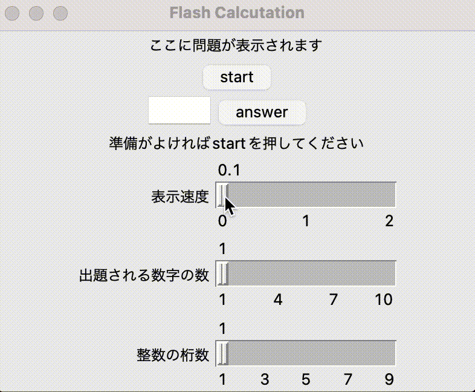

# Flash Caluculation

フラッシュ暗算

## 概要

フラッシュ暗算練習用アプリケーション

## Demo


## 実行方法
```
$ git clone https://github.com/sudo-roa/python_app_GUI.git
$ cd python_app_GUI/Flash_calculation
$ python3 Flash_caluculation.py
```

## 開発の参考
- [「tkinter」で関数実行中にウィンドウがフリーズしてしまう問題を「threading」を使って回避する方法](https://karupoimou.hatenablog.com/entry/20200427/1587975580)
