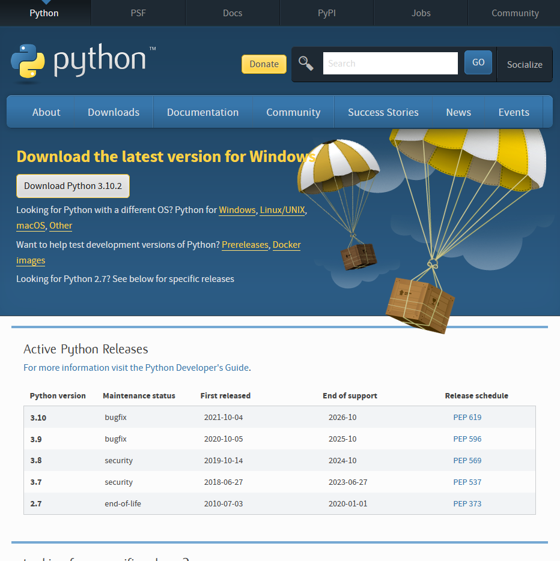
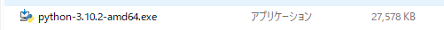
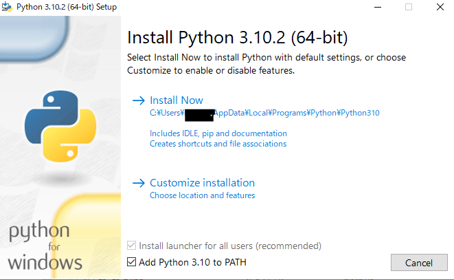
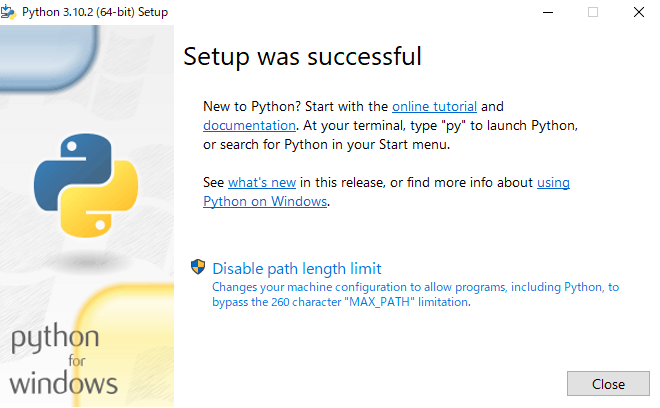
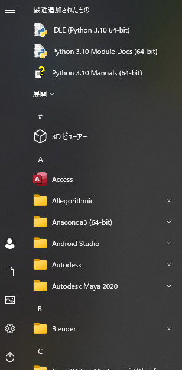
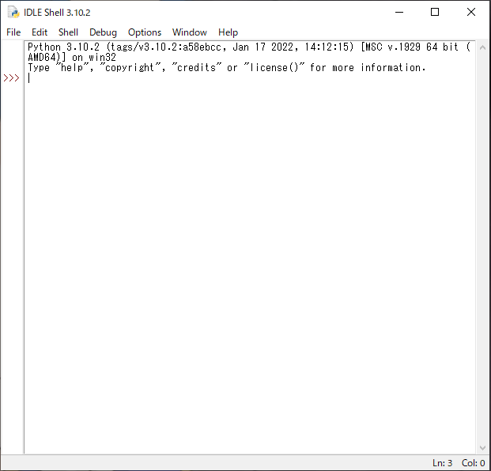

# python_app_GUI
pythonのGUIアプリケーションを作ってみるだけのリポジトリ

## windowsでの開発
pythonのインストールから、統合開発環境での実行まで
### pythonのインストール
- webブラウザで`https://www.python.org/`にアクセス
- Download->Download the latest version for Windowsの下の`Download Python`をクリック


- ダウンロードされた.exeファイルを実行


- Setupウィンドウが表示されたら、`Add Python *.* to PATH`にチェックを入れて、`Install Now`をクリック


- Setup was successfulが表示されたら、`Closeをクリック`


- スタートメニューから`IDLE(python *.* **-bit)`を実行


- 以下のような画面が出てくればインストールできています。



## ubuntuでの開発
UbuntuのPython3にTkinterライブラリをインストール
```
$ sudo apt install python3-tk
```

## macでの開発
多分python3がインスロールされていれば何もしなくても使えるはずです。

